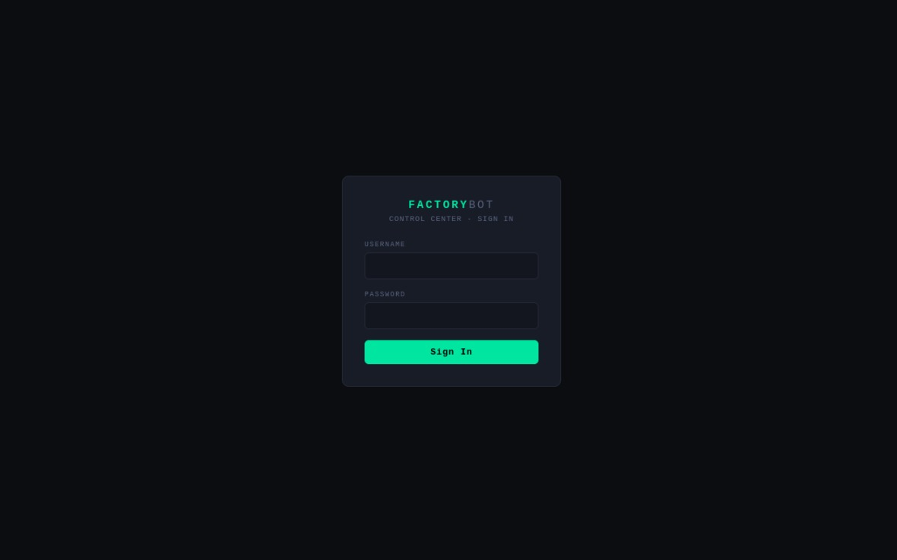
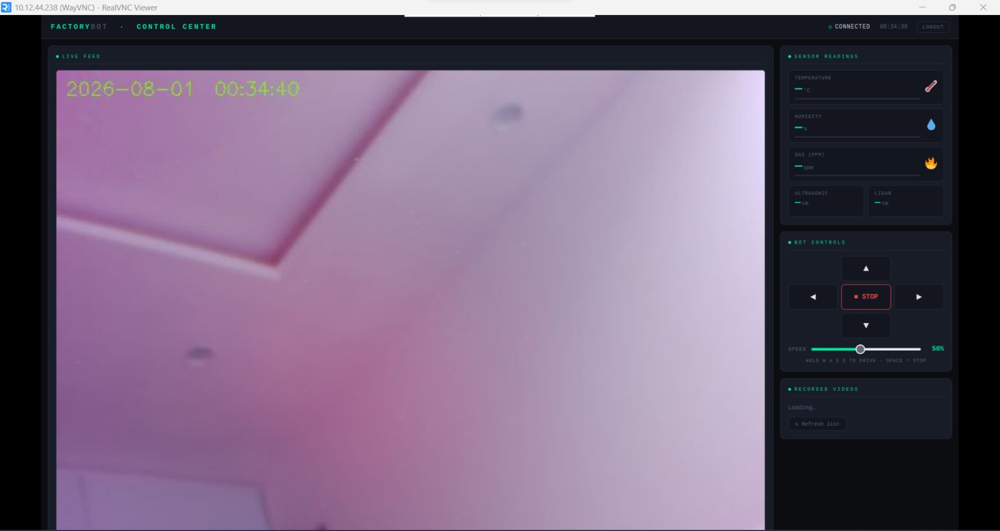
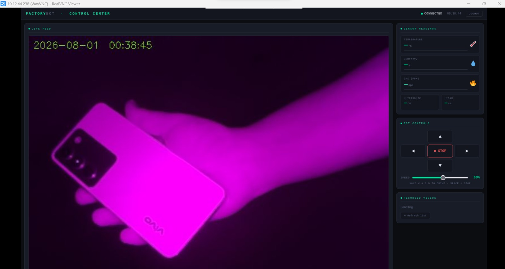
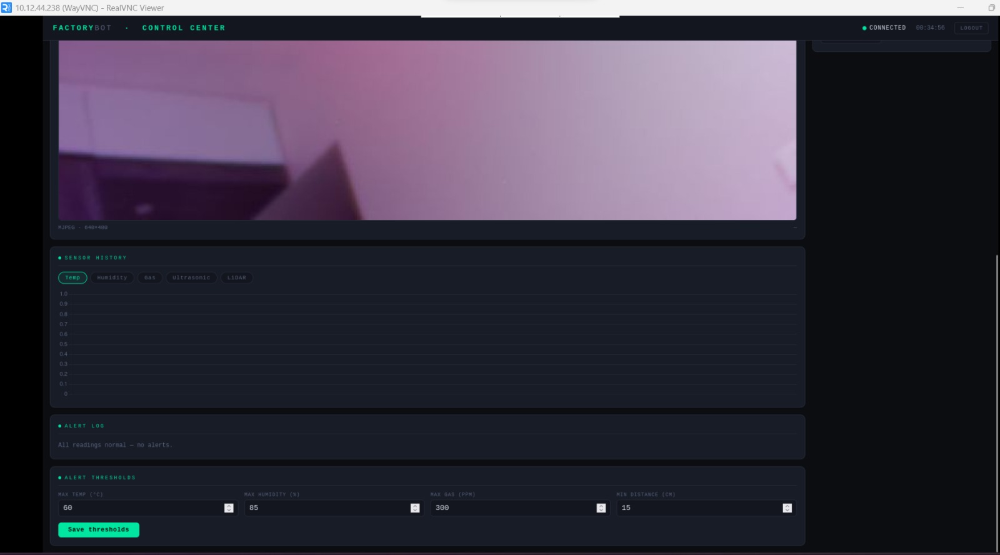

# Factory Surveillance and Hazard Detection Bot

An IoT-based industrial surveillance and hazard detection system that combines Raspberry Pi, ESP32, computer vision, and environmental sensors to provide real-time monitoring through a modern web dashboard.


## Overview

The **Factory Surveillance and Hazard Detection Bot** is designed to enhance industrial safety by providing continuous environmental monitoring, live video surveillance, and centralized system control.

The system integrates a **Raspberry Pi 5**, **ESP32**, and multiple environmental sensors to collect real-time data, process alerts, and present all critical information through an intuitive web dashboard. Operators can remotely monitor the factory environment, view live camera feeds, analyze sensor data, configure alert thresholds, and access recorded surveillance footage from a single interface.

## Key Features

- Secure User Authentication
- Live Camera Streaming
- Real-Time Sensor Monitoring
- Temperature & Humidity Monitoring
- MQ2 Gas Detection
- Ultrasonic Distance Measurement
- LiDAR Distance Monitoring
- Sensor History Visualization
- Alert Logging System
- Configurable Safety Thresholds
- Robot Control Interface
- Recorded Video Management
- Responsive Dark-Themed Dashboard


# Screenshots

## Login Page

Secure authentication interface before accessing the Factory Surveillance Control Center.




## Web Interface (Normal Lighting)

Live monitoring dashboard displaying the camera feed, environmental sensor readings, robot controls, and recorded video management under normal lighting conditions.




## Dashboard – Low-Light Testing

Demonstrates the Raspberry Pi camera performance and surveillance dashboard in low-light industrial environments.




## Sensor Monitoring & Alert Dashboard

Displays real-time sensor history, alert logs, environmental monitoring, and configurable safety thresholds for hazard detection.




# Hardware Components

- Raspberry Pi 5
- Raspberry Pi Camera Module
- ESP32 Development Board
- MQ2 Gas Sensor
- DHT11 Temperature & Humidity Sensor
- Ultrasonic Sensors
- TF-Luna LiDAR
- Servo Motors
- OLED Display
- Active Buzzer


# Software Stack

### Programming Languages

- Python
- HTML5
- CSS3
- JavaScript

### Frameworks & Libraries

- Flask
- OpenCV
- Chart.js

### Hardware Platforms

- Raspberry Pi OS
- ESP32


# System Architecture

```text
                    Environmental Sensors
        ┌─────────────────────────────────────┐
        │  MQ2  │ DHT11 │ Ultrasonic │ LiDAR │
        └─────────────────────────────────────┘
                         │
                         ▼
                    ESP32 Controller
                         │
                         ▼
                  Raspberry Pi 5
          ┌──────────────────────────┐
          │ Camera Module            │
          │ Flask Web Server         │
          │ Sensor Processing        │
          │ Alert Management         │
          └──────────────────────────┘
                         │
                         ▼
               Web Dashboard Interface


# Repository Structure

```text
Factory-Surveillance-and-Hazard-Detection-Bot/
│
├── media/
│   └── images/
│
├── static/
│
├── templates/
│
├── README.md
│
└── ...


# Future Enhancements

- Face Detection
- Human Detection
- Motion Detection
- AI-Based Object Detection
- Email Notifications
- SMS Alerts
- Cloud Video Storage
- Mobile Application
- Multi-User Authentication
- Remote Robot Navigation
- AI-Based Hazard Prediction


# Project Team

This project was collaboratively developed by:

| Team Member | Responsibilities |
|-------------|------------------|
| **Gaurav Pale** | Raspberry Pi Development, Web Dashboard Development, Backend Integration |
| **Smiraj Patil** | Project Coordination, Documentation, Research Paper & Publication |
| **Sherin Mathai** | Research Support, Hardware Procurement, Hardware Integration |
| **Vrushal Patil** | 3D Design & Printing, Web Interface Development, System Integration |


# License

This project was developed for educational and research purposes.


## Acknowledgements

This project was developed as a collaborative Industrial IoT and Computer Vision project focused on improving industrial safety through real-time surveillance and environmental monitoring.
