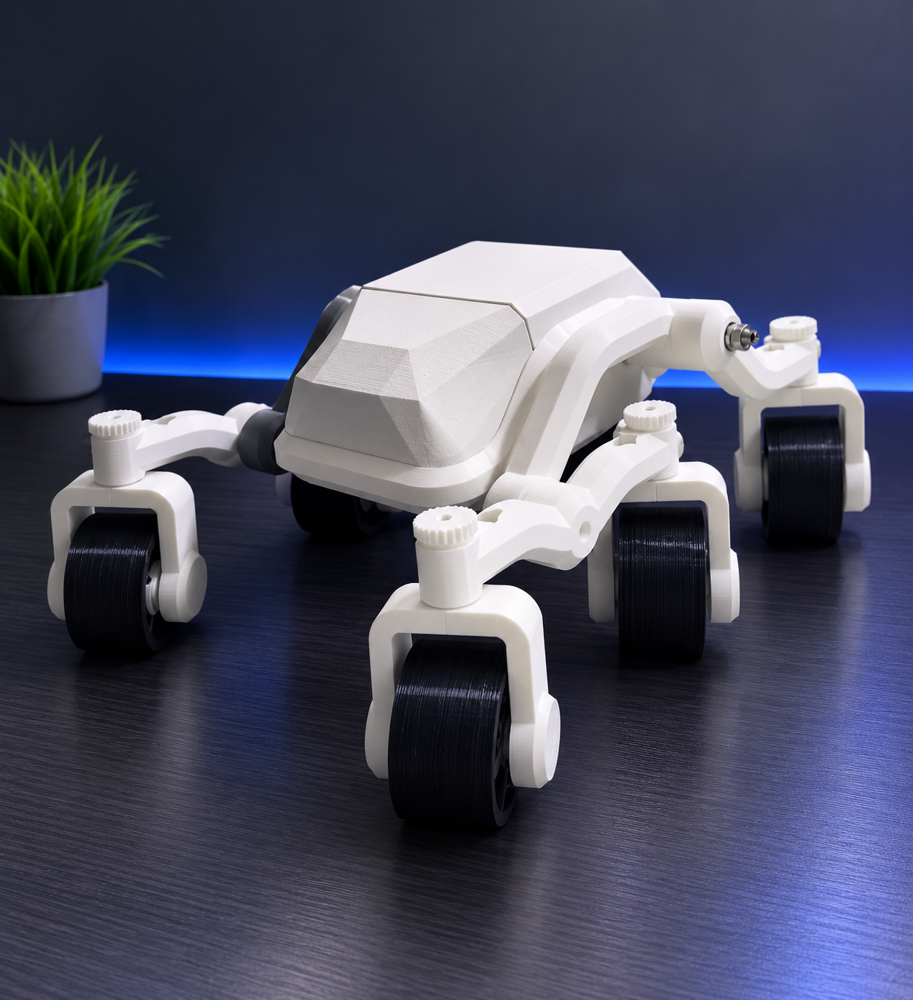

<p align="center">
  
</p>

<h1 align="center">Factory Surveillance and Hazard Detection Bot</h1>

<p align="center">
An IoT-based Industrial Surveillance and Hazard Detection System powered by Raspberry Pi 5, ESP32, Computer Vision, and Environmental Sensors.
</p>

<p align="center">
Industrial IoT • Raspberry Pi 5 • ESP32 • Flask • OpenCV • Computer Vision
</p>

---

# Overview

The **Factory Surveillance and Hazard Detection Bot** is an Industrial IoT project developed to improve workplace safety through continuous environmental monitoring and intelligent surveillance.

The system combines a **Raspberry Pi 5**, **ESP32**, and multiple environmental sensors with a modern web dashboard to provide operators with live monitoring, hazard detection, and centralized robot control.

---

# Objective

Develop a smart industrial surveillance system capable of:

- Monitoring environmental conditions in real time
- Detecting hazardous situations
- Streaming live video
- Providing remote monitoring through a web dashboard
- Improving workplace safety using IoT technologies

---

# Key Features

- Secure User Authentication
- Live Camera Streaming
- Real-Time Sensor Monitoring
- Temperature Monitoring
- Humidity Monitoring
- MQ2 Gas Detection
- Ultrasonic Distance Measurement
- LiDAR Distance Monitoring
- Sensor History Visualization
- Alert Logging System
- Configurable Safety Thresholds
- Robot Control Dashboard
- Recorded Video Management
- Responsive Dark-Themed Interface

---

# Technologies Used

### Hardware

- Raspberry Pi 5
- ESP32
- Raspberry Pi Camera Module
- MQ2 Gas Sensor
- DHT11 Temperature & Humidity Sensor
- Ultrasonic Sensors
- TF-Luna LiDAR
- Servo Motors
- OLED Display
- Active Buzzer

### Software

- Python
- Flask
- HTML5
- CSS3
- JavaScript
- OpenCV
- Chart.js

---

# System Architecture

```text
                Environmental Sensors
      ┌────────────────────────────────────┐
      │ MQ2 │ DHT11 │ Ultrasonic │ LiDAR │
      └────────────────────────────────────┘
                     │
                     ▼
                  ESP32 Board
                     │
                     ▼
               Raspberry Pi 5
      ┌───────────────────────────────┐
      │ Camera Module                 │
      │ Flask Web Server              │
      │ Sensor Processing             │
      │ Alert Management              │
      └───────────────────────────────┘
                     │
                     ▼
            Web Dashboard Interface
```

---

# How It Works

1. Environmental sensors continuously collect live data.
2. ESP32 processes sensor readings.
3. Sensor data is transmitted to the Raspberry Pi.
4. Raspberry Pi processes the incoming information.
5. Flask updates the web dashboard in real time.
6. Operators monitor camera feeds and environmental conditions.
7. Alerts are generated whenever safety thresholds are exceeded.

---

# Screenshots

## Login Page

Secure authentication before accessing the control center.


---

## Web Interface (Normal Lighting)

Live monitoring dashboard displaying:

- Camera Feed
- Environmental Sensor Readings
- Robot Controls
- Recorded Video Management


---

## Sensor Monitoring & Alert Dashboard

Real-time monitoring of:

- Temperature
- Humidity
- Gas Levels
- Sensor History
- Alert Logs
- Safety Threshold Configuration


---

## Dashboard – Low-Light Testing

Demonstrates surveillance capability in low-light industrial environments.


---

# Repository Structure

```text
Factory-Surveillance-and-Hazard-Detection-Bot/
│
├── media/
│   └── images/
│
├── web/
│   ├── app.py
│   ├── requirements.txt
│   ├── static/
│   ├── templates/
│   └── ...
│
├── README.md
│
└── LICENSE (Optional)
```

---

# Future Enhancements

- Face Detection
- Human Detection
- Motion Detection
- AI-Based Object Detection
- Cloud Video Storage
- Email Notifications
- SMS Alerts
- Mobile Application
- Multi-User Authentication
- Remote Robot Navigation
- AI-Based Hazard Prediction

---

# Project Team

| Team Member | Primary Role | Responsibilities |
| :--- | :--- | :--- |
| **Gaurav Pale** | Software Development | Raspberry Pi Development<br>Web Dashboard Development<br>Backend Integration |
| **Smiraj Patil** | Project Management | Project Coordination<br>Documentation<br>Research Paper & Publication |
| **Sherin Mathai** | Hardware Engineering | Research Support<br>Hardware Procurement<br>Hardware Integration |
| **Vrushal Patil** | Mechanical & System Design | 3D Design & Printing<br>Web Interface Development<br>System Integration |

---

# Project Status

**Status:** Active Development

The project is being continuously improved with additional AI-powered surveillance capabilities, enhanced robot control features, and expanded IoT sensor integration.

---

# Acknowledgements

This project was collaboratively developed as an Industrial IoT and Computer Vision solution for improving industrial safety through intelligent surveillance, real-time environmental monitoring, and hazard detection.
